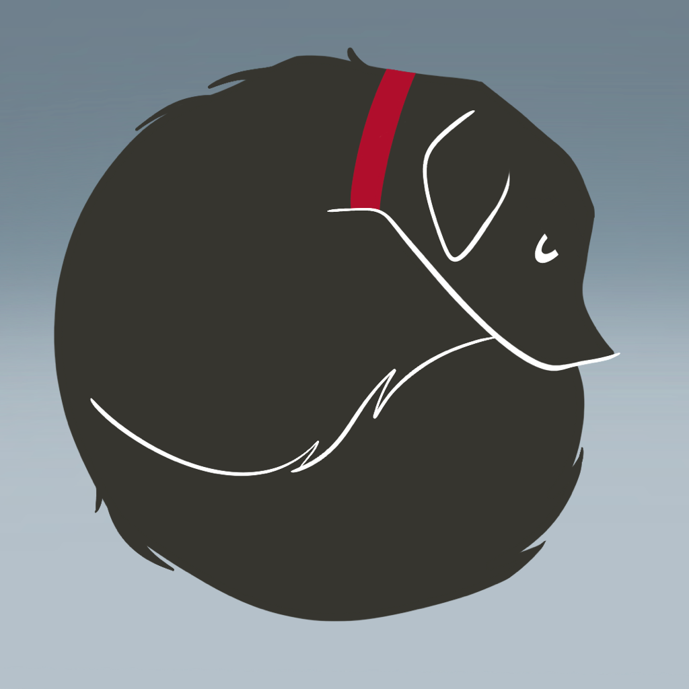
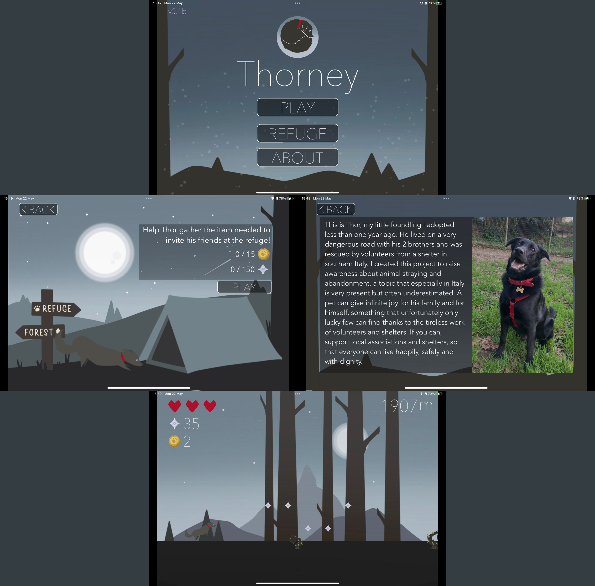

# WWDC23Thorney
WWDC23 Swift Student Challenge Winning project.

Thorney is an endless side scroller game made in Swift with the SpriteKit framework, in which you help Thor to gather resources to grow his refuge to invite his friends, jumping to avoid the obstacles.

* Frameworks: SpriteKit, AVFoundation

 
 
 
 

## Gallery

